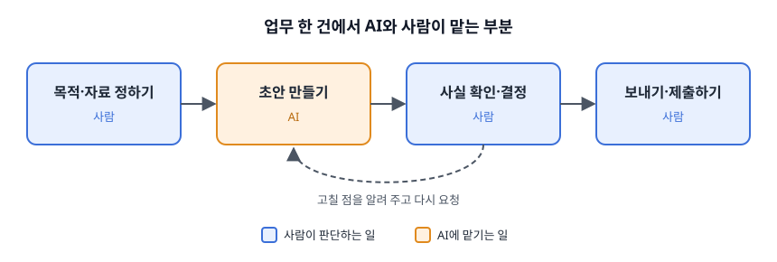

# 1.1 AI가 할 일과 사람이 판단할 일

> [목차](index.md) · 다음: [1.2 채팅과 작업 위임의 차이](01-02-채팅과위임.md)

나는 AI를 업무에 쓰기 전에 일을 먼저 둘로 나눈다. AI에 맡길 일과 내가 판단할 일이다. 이 구분이 없으면 둘 중 하나가 된다. AI가 만든 결과를 그대로 내보내서 문제가 생기거나, 결과를 믿지 못해 처음부터 다시 하느라 시간이 더 든다.

## 이 책에서 말하는 AI

이 책에서 AI는 ChatGPT, Claude, Gemini처럼 글로 요청하면 글·표·이미지 같은 결과를 만들어 주는 도구를 말한다. 이런 도구를 **생성형 AI**라고 부른다. 이미 있는 자료를 찾아 주는 검색과 달리, 요청에 맞춰 새 결과를 만든다는 뜻이다.

생성형 AI가 만든 결과는 대개 그럴듯하다. 문장이 매끄럽고 형식도 갖춰져 있다. 하지만 그럴듯한 것과 맞는 것은 다르다. 사실과 다른 내용이 자연스러운 문장 속에 섞여 나올 수 있다. 같은 요청을 다시 해도 결과가 조금씩 다르게 나올 수 있다.

그래서 나는 AI의 결과를 **초안**으로 다룬다. 초안은 확인하고 고친 뒤에 쓰는 첫 번째 버전이다. 초안을 만드는 일은 맡기고, 초안을 쓸지 말지는 내가 정한다.

## AI에 맡기는 일

나는 이런 일을 AI에 맡긴다.

- **첫 초안 쓰기**: 답장, 공지문, 보고서처럼 빈 화면에서 시작해야 하는 글
- **정리하기**: 흩어진 메모를 항목별로 묶기, 긴 글을 짧게 줄이기
- **형식 바꾸기**: 글을 표로, 딱딱한 말투를 부드러운 말투로, 긴 문서를 한 장짜리로
- **후보 늘어놓기**: 제목 후보, 확인할 질문 목록, 빠뜨린 항목

이 일들에는 공통점이 있다. 결과가 맞는지 내가 보고 판단할 수 있다. 틀려도 밖으로 내보내기 전에 고치면 된다.

## 내가 판단하는 일

반대로 이런 일은 내가 한다.

- **사실 확인**: 날짜, 금액, 이름, 수량, 규정이 맞는지
- **약속**: 환불, 일정, 가격처럼 상대가 믿고 움직일 내용
- **결정**: 여러 안 중 무엇을 고를지, 누구에게 보낼지
- **내보내기**: 발송, 제출, 공개

이 일들의 공통점은 틀렸을 때 책임이 나에게 있다는 것이다. AI 도구는 그 결과를 책임지지 않는다. 고객에게 잘못 안내한 환불 조건은 AI가 쓴 문장이어도 내가 보낸 약속이다.

## 애매할 때 묻는 세 가지

모든 일이 깔끔하게 나뉘지는 않는다. 애매할 때 나는 세 가지를 묻는다.

1. **결과가 맞는지 내가 확인할 수 있는가?** 확인할 방법이 없으면 맡기지 않는다. 맡기더라도 확인할 방법부터 정한다.
2. **틀렸을 때 되돌릴 수 있는가?** 초안은 지우면 된다. 이미 보낸 메일은 되돌릴 수 없다.
3. **틀렸을 때 누가 책임지는가?** 책임이 나에게 있으면 마지막 판단도 내가 한다.

확인할 수 있고, 되돌릴 수 있고, 틀려도 부담이 작다면 AI에 맡기고 결과만 확인한다. 하나라도 걸리면 그 부분은 내가 직접 판단한다.

## 업무 하나를 나누면

대부분의 업무는 통째로 맡기거나 통째로 내가 하는 게 아니다. 한 업무 안에서 단계별로 나뉜다.

앞과 뒤는 사람이 맡는다. 무엇을 위해 어떤 자료로 할지 정하는 일, 그리고 결과를 확인하고 내보내는 일이다. 가운데 초안 만들기를 AI에 맡긴다. 초안이 마음에 들지 않으면 고칠 점을 알려 주고 다시 요청한다. 이 반복은 여러 번 해도 된다. 다만 몇 번을 반복했든 확인과 결정은 건너뛰지 않는다.

아래 표는 흔한 업무를 이 기준으로 나눠 본 예시다. 내가 실제로 해 본 기록이 아니라 설명을 위한 예시다.

| 업무 | AI에 맡기는 부분 | 내가 판단하는 부분 |
| --- | --- | --- |
| 고객 문의 답장 | 정중한 문장 초안, 말투 다듬기 | 환불·교환 가능 여부, 약속할 날짜, 발송 |
| 회의록 | 메모를 결정 사항과 할 일로 정리 | 정말 결정된 것인지, 담당자와 기한 |
| 행사 안내문 | 문구와 구성 초안 | 날짜·장소·가격, 공개 시점 |
| 월말 매출 정리 | 표 형식, 요약 문장 | 숫자가 원본과 맞는지 |

AI에 어떤 자료를 넣으면 안 되는지, 결과를 어떻게 확인하는지는 3장에서 자세히 다룬다.

> ✍️ **[채우기]** 내 업무 하나를 이 기준으로 나눠 본 실제 사례. 무엇을 맡겼고 무엇을 내가 판단했는지, 나누기 전과 뒤에 무엇이 달라졌는지 적는다.

## 해 보기

내가 자주 하는 업무 세 가지를 적는다. 업무마다 위 표처럼 AI에 맡길 부분과 내가 판단할 부분을 나눠 본다. 이 목록은 1.3에서 첫 실습거리를 고를 때 다시 쓴다.

| 내 업무 | AI에 맡길 부분 | 내가 판단할 부분 |
| --- | --- | --- |
| | | |
| | | |
| | | |
