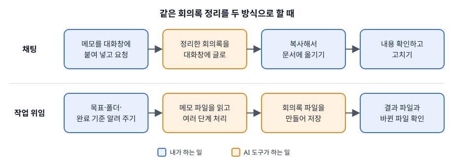

# 1.2 채팅과 작업 위임의 차이

> [목차](index.md) · 이전: [1.1 AI가 할 일과 사람이 판단할 일](01-01-역할구분.md) · 다음: 1.3 내 업무에서 첫 실습거리 고르기 (작성 예정)

AI 도구를 쓰는 방식은 크게 두 가지다. 채팅과 작업 위임이다. 같은 업무라도 어느 방식으로 하느냐에 따라 내가 할 일과 확인할 것이 달라진다.

## 채팅

**채팅**은 질문을 보내고 답을 글로 받는 방식이다. 결과는 대화창에 나온다. 그 결과를 문서나 메일로 옮기는 일은 내가 한다. ChatGPT나 Claude를 처음 열었을 때 보이는 대화창이 이 방식이다.

## 작업 위임

**작업 위임**은 목표와 자료가 있는 곳을 알려 주고, 여러 단계의 일을 AI 도구가 이어서 처리하게 하는 방식이다. 도구가 내 컴퓨터의 폴더나 연결된 서비스의 파일을 직접 읽는다. 결과도 대화창의 글이 아니라 파일로 만들거나 기존 파일을 고친다. Claude의 Cowork, OpenAI의 Codex 같은 도구가 이 방식으로 일한다.

이처럼 여러 단계를 이어서 처리하는 AI 도구를 **에이전트**라고 부르기도 한다. 에이전트에 일을 맡기는 법은 4부에서 다룬다. 도구의 이름과 기능은 자주 바뀌므로 여기서는 두 방식의 차이에만 집중한다.

## 같은 일을 두 방식으로

지난주 회의 메모 세 개를 회의록으로 정리한다고 해 보자.

채팅으로 하면 메모 세 개를 대화창에 붙여 넣고 "회의록으로 정리해 줘"라고 요청한다. 정리된 글이 대화창에 나온다. 나는 그 글을 읽고 회사 회의록 양식에 복사해 옮긴 뒤 고친다.

작업 위임으로 하면 메모가 들어 있는 폴더를 알려 주고 이렇게 요청한다. "각 메모를 회의록 양식으로 바꿔서 같은 폴더에 새 파일로 저장해 줘. 원본 메모는 고치지 마." 도구가 파일 세 개를 읽고 회의록 파일 세 개를 만든다. 나는 만들어진 파일을 열어 확인한다.

## 무엇이 달라지나

| | 채팅 | 작업 위임 |
| --- | --- | --- |
| 결과물 | 대화창의 글 | 파일, 또는 연결된 서비스의 변경 |
| 결과를 옮기는 일 | 내가 한다 | 도구가 한다 |
| 한 번에 다루는 양 | 붙여 넣은 만큼 | 폴더 안의 여러 파일 |
| 확인할 것 | 답의 내용 | 결과의 내용, 그리고 무엇을 만들고 고쳤는지 |
| 잘못됐을 때 | 대화창의 글이므로 쓰지 않으면 된다 | 원본 파일이 이미 바뀌었을 수 있다 |

작업 위임은 옮기는 수고를 줄여 준다. 대신 확인할 범위가 넓어진다.

여기서부터는 내 해석이다. 채팅에서는 결과를 내 손으로 옮기는 과정이 그 자체로 한 번의 검토가 된다. 옮기면서 문장을 읽게 되기 때문이다. 작업 위임에서는 그 과정이 사라진다. 그래서 결과 파일을 따로 열어 보고, 요청하지 않은 파일이 바뀌지 않았는지도 확인해야 한다.

1.1의 세 가지 질문 중 "틀렸을 때 되돌릴 수 있는가?"가 여기서 특히 중요해진다. 채팅의 결과는 버리면 끝이다. 작업 위임은 파일을 직접 바꾸므로 되돌리기 어려울 수 있다. 그래서 작업 위임은 원본을 복사해 둔 폴더에서 시작하는 것이 안전하다. 이 방법은 11장에서 다룬다.

## 나는 이렇게 고른다

채팅이 맞는 경우는 이렇다.

- 결과가 짧아서 한눈에 확인할 수 있다.
- 다룰 자료가 한두 개다.
- 결과를 어차피 내가 다른 곳에 옮겨 써야 한다.

작업 위임이 맞는 경우는 이렇다.

- 여러 파일을 같은 방식으로 처리해야 한다.
- 결과를 파일로 받아야 한다.
- 같은 일을 자주 반복한다.

처음이라면 채팅부터 시작한다. 결과를 내 눈으로 한 번씩 거치면서 AI가 어떤 결과를 내는지 먼저 익히는 편이 낫다. 이 책도 1부와 2부는 채팅으로 진행하고, 3부부터 작업 위임을 다룬다.

> ✍️ **[채우기]** 같은 업무를 채팅과 작업 위임으로 각각 해 본 비교. 걸린 시간, 확인하면서 발견한 문제, 어느 쪽이 내 업무에 맞았는지 적는다.

## 해 보기

1.1에서 적은 내 업무 세 가지를 다시 본다. 업무마다 채팅으로 끝낼 수 있는지, 작업 위임이 나은지 표시하고 그 이유를 한 줄로 적는다.

| 내 업무 | 채팅 / 작업 위임 | 이유 |
| --- | --- | --- |
| | | |
| | | |
| | | |
