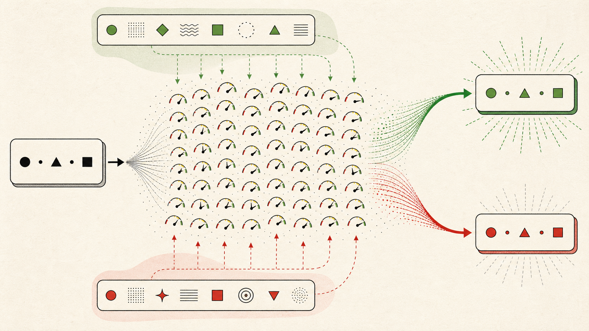

# AI Harness — AI에게 일을 맡기기 전에 만들어야 하는 것

> 15년째 코드를 짜고 있는 개발자가, AI와 일하는 방식을 다시 설계한 기록.
> AI로 코딩을 해봤지만 "왜 어떤 날은 잘 되고 어떤 날은 엉망인지" 모르겠는 주니어를 위해 씁니다.

---

## 0. 시작은 실패였다

> ✍️ **[경험 채우기]** 여기에 당신이 겪은 구체적인 사건 하나를 넣으세요.
> AI가 만든 코드를 믿고 커밋했다가 터진 일, 같은 프롬프트를 두 번 던졌는데 다른 결과가 나온 일,
> 잘 되던 작업이 다음 날 갑자기 안 되던 일 — 날짜, 파일, 증상까지 구체적으로.
>
> **가능하면 "경계를 잘못 그었던" 사건으로 고르세요.** 넘기지 말았어야 할 영역을 넘겼거나,
> 반대로 붙잡고 있을 필요 없는 걸 붙잡고 있었던 경험. 1장의 토발즈 사례와 정면으로 맞물려서
> 글 전체가 하나의 질문("어디까지 맡길 것인가")으로 꿰어집니다.
>
> 이 한 장면이 이 글 전체보다 설득력이 있습니다. 정의는 그 다음입니다.

이 글은 그 실패 이후에 내가 무엇을 바꿨는지에 대한 이야기입니다.

---

## 1. Vibe Coding — 선언과 커밋

### 카파시: 선언

2025년 2월, 안드레이 카파시(Andrej Karpathy)가 **vibe coding**이라는 말을 만들었습니다.[^1] 코드의 존재 자체를 잊고 흐름에 몸을 맡기라는 것. 자연어로 말하면 코드가 나오는 시대에, 그건 과장이 아니라 실제로 가능해지고 있었습니다.

이건 **선언**입니다. 무엇이 가능해졌는지에 대한.

### 토발즈: 커밋

한편 리누스 토발즈는 선언 대신 커밋을 남겼습니다.[^2]

```
Merge branch 'antigravity'

This is Google Antigravity fixing up my visualization tool (which was
also generated with help from google, but of the normal kind).

It mostly went smoothly, although I had to figure out what the problem
with using the builtin rectangle select was. After telling antigravity
to just do a custom RectangleSelector, things went much better.

Is this much better than I could do by hand? Sure is.
```

이 커밋이 퍼지면서 인터넷에는 *"토발즈도 바이브 코딩을 지지했다"*는 말이 돌았습니다. **오독입니다.**

정확히 무슨 일이 있었는지 보면 이렇습니다.

- Python은 그의 전문 분야가 아닙니다.
- 원래도 그 영역은 Stack Overflow와 구글 검색에 의존했습니다.
- 이번엔 검색해서 붙여넣는 대신 Antigravity를 썼습니다.
- **시각화 도구 정도는** AI가 자기보다 훨씬 낫다고 인정했습니다.
- 그리고 **핵심 DSP 코드(C)는 자기 손으로 직접 짰습니다.**

이건 AI 예찬도 아니고 회의론도 아닙니다. **적재적소의 실용주의**입니다.

### 진짜 질문은 "쓰느냐"가 아니다

사람들이 저 커밋을 오독한 이유는, AI를 **쓴다/안 쓴다**의 이분법으로 읽었기 때문입니다. 하지만 토발즈가 실제로 내린 결정은 그 층위가 아닙니다.

> **"내 코드베이스의 어디까지를 AI에게 넘길 것인가?"**

그는 경계를 그었습니다. 주변부(내 전문 분야가 아니고, 틀려도 눈으로 확인되는 시각화 도구)는 넘겼고, 핵심(신호 처리 로직)은 넘기지 않았습니다. 게다가 그 작업을 별도 브랜치(`antigravity`)에 격리했고, 막혔을 때는 답이 아니라 **방향**을 줬으며(`just do a custom RectangleSelector`), 최종적으로 *"내가 손으로 짠 것보다 나은가?"*라는 자기 기준으로 평가한 뒤 머지했습니다.

**이 문단에 나오는 것 — 경계, 격리, 개입, 평가 기준 — 이 전부 harness입니다.** 그는 harness라는 말을 쓰지 않았을 뿐, 이미 그렇게 일하고 있었습니다.

그리고 커밋에는 그의 이름이 박혀 있습니다. **책임은 도구가 아니라 머지한 사람에게 있기 때문입니다.**

이 글은 그 경계를 어떻게 설계할 것인가에 대한 이야기입니다.

[^1]: Andrej Karpathy, X(구 Twitter), 2025-02-02. https://x.com/karpathy/status/1886192184808149383
[^2]: ✍️ **[채우기]** 저장소 주소와 커밋 해시를 확인해서 넣으세요.

---

## 2. AI Literacy — 규칙에서 확률로

AI를 잘 쓰려면 먼저 **AI가 무엇을 하는 도구인지** 알아야 합니다. 거창한 정의보다 에어컨의 온도 조절 다이얼에서 시작해봅시다.

### 규칙은 사람이 쓴다

오래된 에어컨의 다이얼은 단순합니다. 다이얼을 이 위치까지 돌리면 압축기를 켜고, 저 위치로 돌아오면 끕니다. 전기 사용량도 그 규칙을 따라 달라집니다.

입력과 출력 사이에 있는 조건은 사람이 정했습니다. 요구사항을 `if` 문으로 옮길 수 있다면 **규칙 기반 시스템(rule-based system)**입니다. 규칙이 틀렸다면 코드를 찾아 고치면 됩니다. 누가 왜 그렇게 동작하는지 설명하기도 쉽습니다.

그렇다고 단순한 규칙 기반 시스템을 낮은 수준의 AI라고 부를 필요는 없습니다. 여기서 중요한 건 이름이 아니라 **규칙을 누가 만들었는가**입니다.


*왼쪽은 사람이 규칙을 정하고, 오른쪽은 데이터가 파라미터를 조정한다.*

### 학습은 관계를 조정한다

이번에는 사람의 키로 몸무게를 추정한다고 해봅시다. 개발자가 모든 키에 대응하는 몸무게를 `if` 문으로 적는 건 좋은 방법이 아닙니다. 대신 여러 사람의 키와 몸무게를 데이터로 주고, 예측값과 실제값의 차이가 줄어드는 방향으로 내부의 수치를 조금씩 바꿉니다.

이 과정이 **학습(training)**입니다. 학습이 끝난 뒤 새로운 키를 넣으면, 모델은 데이터에서 조정한 관계를 사용해 몸무게를 추정합니다.

여기서 모델이 자연법칙을 발견한 것은 아닙니다. 주어진 데이터 안에서 오차를 줄이는 관계를 찾았을 뿐입니다. 데이터의 범위가 좁거나 한쪽으로 치우쳤다면 예측도 그 한계를 그대로 물려받습니다.

### 파라미터는 지식 목록이 아니다

학습 과정에서 조정되는 내부 수치를 **파라미터(parameter)**라고 부릅니다.

오디오 믹서를 떠올리면 쉽습니다. 믹서에는 수많은 노브와 슬라이더가 있습니다. 하나만 돌려서는 원하는 소리가 나오지 않습니다. 여러 조절값의 조합이 최종 출력을 만듭니다.


*파라미터 하나가 규칙 하나를 뜻하지 않는다. 수많은 값의 조합이 출력을 만든다.*

모델의 파라미터도 비슷합니다. 특정 파라미터 하나를 열어보면 `사과는 과일이다` 같은 지식이 적혀 있는 게 아닙니다. 수많은 값이 함께 작동하면서 어떤 입력 다음에 어떤 출력이 자연스러운지를 결정합니다.

이 비유에도 한계는 있습니다. 실제 모델의 파라미터는 사람이 의미를 붙여 하나씩 조절하는 믹서 노브가 아닙니다. **핵심은 지식이 문장 목록으로 저장되는 게 아니라, 많은 수치의 관계에 분산된다는 것**입니다.

### 출력은 이해의 증거가 아니라 예측의 결과다

`Apple is a fruit`를 번역하면 `사과는 과일이다`가 나옵니다. 결과만 보면 모델이 사과와 과일의 의미를 사람처럼 이해한 것처럼 보입니다.

모델의 동작을 다루는 데는 더 실용적인 설명이 있습니다. 학습 데이터와 현재 맥락을 조건으로, **다음에 올 가능성이 높은 출력을 예측했다**는 설명입니다.

분류도 같습니다. Houston에서 수집한 문장만 반복해서 보여주고 그 데이터에 특정 레이블을 붙였다면, 모델은 그 데이터에서 자주 나타난 표현을 그 레이블의 단서로 사용합니다. 그것이 Houston의 본질을 이해했다는 뜻은 아닙니다. 학습 분포가 달라지면 확률도 달라집니다.



*같은 입력도 함께 주어진 맥락과 학습된 분포에 따라 다른 후보가 강해진다.*

그래서 모델이 그럴듯한 문장을 만들었다는 사실만으로는 내용을 이해했다거나 사실을 확인했다고 말할 수 없습니다. **유창함과 정확함은 다른 속성입니다.**

### 컴파일러와 다른 계약

우리가 지금까지 올라온 추상화의 사다리를 봅시다.

| 단계 | 입력 | 같은 입력 → 같은 출력? |
| --- | --- | --- |
| 기계어 | `10110000 01100001` | ✅ |
| 어셈블러 | `MOV AL, 61h` | ✅ |
| 고급 언어 | `int a = 97;` | ✅ |
| 프레임워크 | `@Entity class User {}` | ✅ |
| **자연어(LLM)** | **"User 엔티티 만들어줘"** | **보장되지 않음** |

컴파일러와 스크립트에 익숙한 개발자에게 이 마지막 칸은 **고통**입니다. 우리가 배운 디버깅 습관 — 재현하고, 좁히고, 고치고, 다시 재현해서 확인한다 — 은 같은 입력과 환경이면 같은 결과가 나온다는 계약 위에 서 있기 때문입니다.

모델, 프롬프트, 도구, 컨텍스트, 생성 설정을 고정하면 LLM의 재현성을 높일 수 있습니다. 특정 조건에서는 같은 결과가 반복되기도 합니다. 하지만 그것은 컴파일러가 제공하는 것과 같은 입력-출력 계약이 아닙니다. 모델 버전, 도구의 응답, 컨텍스트의 작은 차이, 토큰 선택 방식이 결과를 바꿀 수 있습니다.

그 차이는 실무에서 이런 모습으로 나타납니다.

- **할루시네이션**: 존재하지 않는 API와 파라미터를 그럴듯하게 만듭니다.
- **과잉 구현**: 요청하지 않은 추상화와 기능까지 추가합니다.
- **누락**: 꼭 필요한 조건이나 파일을 조용히 빼먹습니다.
- **왜곡**: 사실과 요구사항을 미묘하게 바꿉니다.

여기서 결론 하나. **AI를 더 좋은 컴파일러로 취급하면 실패합니다.** 결과가 흔들리는 도구는 믿음으로 다루지 않습니다. 행동하게 하고, 결과를 관찰하고, 검증하는 루프로 다룹니다.

그 루프를 도는 주체가 Agent입니다.

---

## 3. Agent — 핵심은 추론이 아니라 판단이다

LLM과 Agent는 다릅니다.

- **LLM**은 텍스트를 생성합니다.
- **Agent**는 도구를 쓰고, 결과를 관찰하고, 다음 행동을 결정합니다. 즉 **루프를 돕니다.**

그래서 Agent의 성능을 결정하는 건 모델의 추론력(reasoning)만이 아닙니다. **지금 이 상황에서 어떤 도구를, 어떤 순서로 쓸 것인가**를 고르는 능력 — 판단(decision)입니다.

아리스토텔레스는 이걸 **실천지혜(Phronesis)**라고 불렀습니다. 보편적 진리를 아는 능력(Logos)이 아니라, 구체적 상황에서 옳은 선택을 하는 능력입니다.

> 수학 경시대회 문제를 푸는 능력이 뛰어난 것과,
> "이건 계산기로 1초면 되는데"를 알아채는 능력은 다릅니다.
> Agent에게 필요한 건 후자입니다.

1장의 토발즈가 한 것이 정확히 이 판단입니다. *"Python 시각화는 넘기고, C DSP는 내가 짠다."* 이건 추론이 아닙니다. 자기 실력, 도구의 강점, 틀렸을 때의 비용을 동시에 저울에 올린 **판단**입니다.

그리고 이 판단력은 **모델을 바꿔서 얻는 게 아니라, 환경을 설계해서 얻습니다.** 그게 harness입니다.

> 📎 아리스토텔레스 프레임워크(Telos/Aisthesis/Techne/Nous 매핑)를 더 깊이 다루고 싶다면
> 본문이 아니라 별도 글이나 부록으로 빼세요. 여기서는 위 한 문단이면 충분합니다.

---

## 4. 왜 Harness Engineering인가

요즘 흐름을 따라가기가 벅찰 정도입니다.

**Prompt Engineering → Context Engineering → Harness Engineering → Loop Engineering**

이 흐름의 중심에는 하나의 방향이 있습니다. *AI Agent가 인간의 개입(HITL, Human In The Loop) 없이 원하는 결과물을 뽑아내게 만들자.*

**나는 그 방향에 온전히 동의하지 않습니다.** 책임은 내가 지기 때문입니다.

내 목표는 인간을 루프에서 빼는 게 아닙니다. **내가 판단해야 할 지점을 정확히 설계하는 것**입니다.
- 결정은 내가 한다.
- AI는 신뢰할 만한 코드를 생성한다.
- 그 코드를 **평가할 수 있는 환경**을 내가 만든다.

세 번째가 harness engineering입니다.

### 여담: Loop Engineering은 왜 조심해야 하는가

루프를 길게 돌릴수록 결과는 좋아집니다. 대신 토큰을 엄청나게 먹습니다. 회사 예산으로 돌리는 사람과, 개인 요금제로 돌리는 사람의 전략은 같을 수 없습니다.

**토큰이 한정된 개발자에게 루프는 "정확한 경계"와 함께 써야 하는 도구입니다.** 무한 루프가 아니라, 종료 조건이 명시된 루프. 이것도 harness 설계의 일부입니다.

---

## 5. Harness란 무엇인가

> **Harness Engineering: AI Agent가 일하는 환경을 설계하고 운영하는 체계.**

harness는 원래 마구(馬具)입니다. 말을 느리게 만드는 장치가 아니라, 말의 힘을 수레에 전달하는 장치입니다. 이 은유가 정확합니다. **AI를 제약하는 게 아니라, AI의 출력을 쓸모 있는 방향으로 전달하는 구조입니다.**

harness는 다섯 개의 축으로 이루어집니다.

| 축 | 질문 | 구체적 수단 |
| --- | --- | --- |
| **권한** | AI가 무엇을 건드릴 수 있는가 | 파일 범위, 승인 모드, 금지 명령 |
| **도구** | AI가 무엇을 쓸 수 있는가 | 빌드, 테스트, 린터, 스크립트 |
| **검증** | 결과가 맞다고 어떻게 확신하는가 | 테스트, 타입 체크, 리뷰 게이트 |
| **상태** | AI가 무엇을 기억하는가 | 컨텍스트, 문서, 메모리 |
| **관측** | AI가 무엇을 했는지 어떻게 아는가 | 로그, diff, 트레이스 |

### 세 가지 관심사의 분리

> 누가(**Agent**) / 무엇을(**Task**) / 어떻게(**Skill**)를
> **독립적으로 설계하되, 실행 시점에 연동하라.**

이 원칙이 harness 설계의 뼈대입니다. 셋을 뭉뚱그리면 — 예를 들어 "리뷰 잘하는 프롬프트" 하나에 역할·작업·방법을 다 우겨넣으면 — 재사용이 안 되고, 어디가 잘못됐는지 좁힐 수도 없습니다.

> ✍️ **[출처]** 원본 메모의 `p58`, `32 Page`는 각주로 정리하세요.
> 예: [^1]: Claude Code 공식 문서, "Agents and Skills", p.58

---

## 6. Harness 구현하기

여기서부터는 개념이 아니라 실물입니다.

### 6.1 Agent — 누가

> ✍️ **[채우기]** 실제로 정의한 Agent 하나를 통째로 보여주세요.
> - 어떤 역할인지 (예: 스키마 리뷰어, 마이그레이션 작성자)
> - 왜 이 역할을 분리했는지 (분리하기 전에 뭐가 문제였는지)
> - 실제 정의 파일 내용 (frontmatter 포함, 통째로)
> - 도구 권한을 왜 그렇게 제한했는지

### 6.2 Skill — 어떻게

> ✍️ **[채우기]** Agent와 Skill을 나눈 기준을 실제 예제로 보여주세요.
> 주니어가 가장 헷갈리는 지점입니다. "역할 vs 절차"라는 추상적 설명보다,
> "이건 Agent로 만들었다가 Skill로 옮겼다. 왜냐하면…" 같은 실패-수정 이야기가 훨씬 잘 박힙니다.

### 6.3 검증 루프 — harness의 진짜 몸통

AI가 만든 코드를 신뢰하는 유일한 방법은 **믿지 않는 것**입니다. 대신 검증합니다.

> ✍️ **[채우기]** 당신의 검증 게이트를 순서대로 나열하세요.
> 타입 체크 → 린트 → 유닛 테스트 → 통합 테스트 중 어디까지 자동화했는지,
> 어느 게이트를 통과 못 하면 AI에게 다시 시키는지, 그 명령어까지.

여기서 핵심은 **검증이 AI에게 자동으로 되먹임되어야 한다**는 점입니다. 사람이 테스트를 돌려보고 결과를 복사해서 알려주는 구조라면, 그건 harness가 아니라 그냥 수동 작업입니다.

### 6.4 Coding Principles — harness에 박아 넣는 제약

원칙을 아는 것과 AI에게 지키게 하는 것은 다릅니다. **원칙은 문서에 적어두는 게 아니라, 검증 가능한 형태로 harness에 넣어야 작동합니다.**

| 원칙 | 의미 | harness에 넣는 법 |
| --- | --- | --- |
| **DRY** (Don't Repeat Yourself) | 같은 지식을 두 곳에 두지 않는다 | 중복 검출 린터, 리뷰 체크리스트 |
| **Rule of Three** | 세 번 중복될 때 추상화를 고려한다 | 리뷰 규칙 — *두 번째 중복에서 성급히 추상화하는 것*이 AI의 대표적 과잉 구현 |
| **KISS** (Keep It Simple, Stupid) | 단순함이 기본값 | 복잡도 임계치, "왜 이 추상화가 필요한지" 설명 요구 |
| **YAGNI** (You Aren't Gonna Need It) | 지금 필요 없으면 만들지 않는다 | AI가 가장 자주 어기는 원칙. diff 범위 제한으로 강제 |
| **SRP** (Single Responsibility Principle) | 하나의 이유로만 바뀐다 | 파일/함수 크기 게이트 |
| **SoC** (Separation of Concerns) | 관심사를 섞지 않는다 | 레이어 의존성 규칙 |
| **Meaningful Naming** | 이름이 곧 문서 | 프로젝트 용어집을 컨텍스트로 제공 |

> ✍️ **[채우기]** 이 중 AI가 실제로 가장 많이 어긴 원칙 하나를 골라, 실제 diff와 함께 보여주세요.
> 제 경험상 YAGNI와 Rule of Three가 압도적입니다.

---

## 7. 마무리 — 판단은 여전히 사람의 몫

harness를 잘 만들어도 AI의 판단은 통계적 패턴 매칭입니다. 전례 없는 상황에서 진짜 실천지혜를 발휘하지는 못합니다.

그리고 판단이 틀렸을 때, **책임은 harness를 설계한 개발자와 목표를 설정한 사람에게 있습니다.** AI는 책임의 주체가 아닙니다.

그래서 harness engineering은 결국 이런 질문으로 되돌아옵니다.

> **"나는 이 코드에 대해 책임질 수 있는가?"**
> 그렇다고 말할 수 있게 만드는 장치 — 그게 harness입니다.

토발즈가 시각화 도구는 넘기고 DSP는 넘기지 않은 이유도 결국 같습니다. **책임질 수 있는 만큼만 넘긴 것입니다.** 그 경계는 사람마다, 프로젝트마다 다릅니다. 그리고 실력이 늘면 경계도 움직입니다.

주니어에게 하고 싶은 말은 하나입니다.
AI를 잘 쓰는 법을 배우기 전에, **AI가 만든 걸 검증하는 법을 먼저 배우세요.** 검증할 수 있는 만큼만 맡길 수 있고, 맡길 수 있는 만큼만 빨라집니다. 순서가 반대면 속도는 늘어도 실력은 늘지 않습니다.

---

## 부록: 용어 정리

| 용어 | 뜻 |
| --- | --- |
| **HITL** (Human In The Loop) | 자동화된 루프 중간에 사람의 판단이 들어가는 구조 |
| **Non-deterministic** | 같은 입력에 같은 출력이 보장되지 않는 성질 |
| **Hallucination** | 사실이 아닌 내용을 사실처럼 생성하는 현상 |
| **Agent** | 도구를 쓰고 결과를 관찰하며 루프를 도는 AI 실행 단위 |
| **Skill** | Agent가 특정 작업을 수행하는 절차적 지식 |
| **Harness** | Agent가 일하는 환경(권한·도구·검증·상태·관측)의 총체 |
