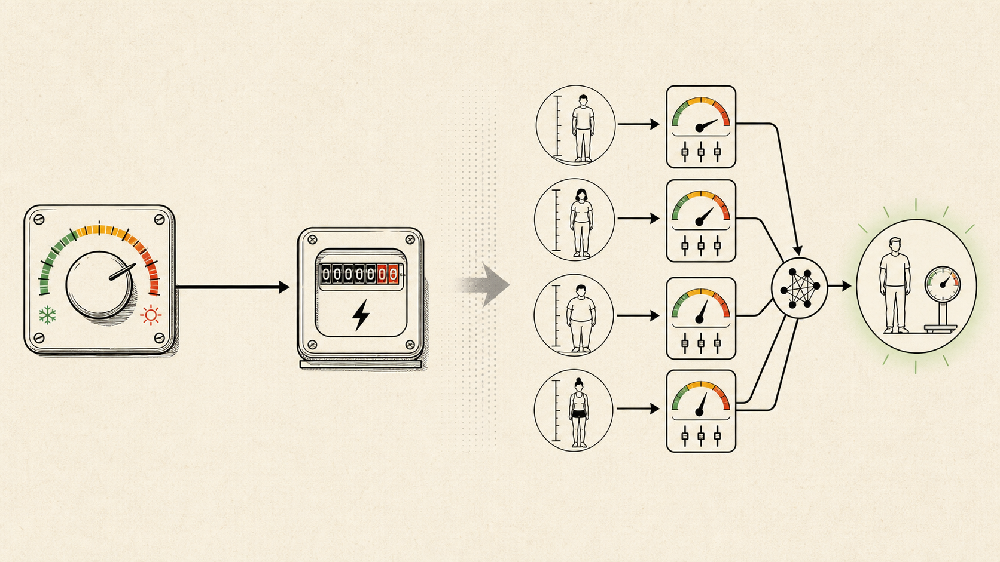
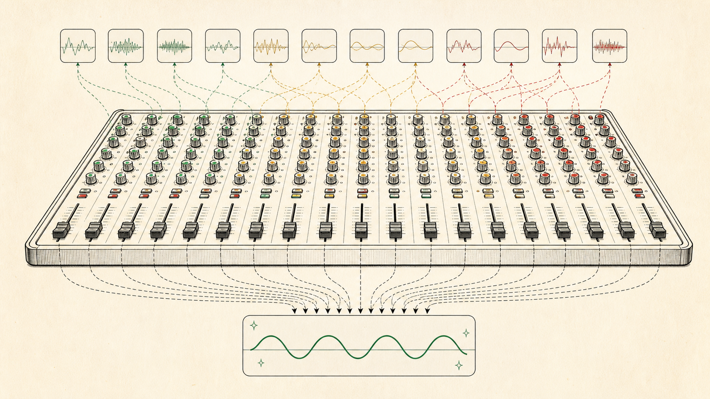

# AI Harness — AI에게 일을 맡기기 전에 만들어야 하는 것

> ✍️ **[채우기]** N년째 코드를 짜고 있는 개발자가, AI와 일하는 방식을 다시 설계한 기록.
> AI로 코딩을 해봤지만 "왜 어떤 날은 잘 되고 어떤 날은 엉망인지" 모르겠는 주니어를 위해 쓴다.

> 네 편짜리 시리즈의 **1편**이다. 이 글은 **왜 harness가 필요하고 그것이 무엇인지**까지를 다룬다.
> 그 안에서 무엇을 강제하고(2편), 어떤 흐름으로 돌리고(3편), 어떤 파일로 만드는지(4편)는 이어지는 글에서 다룬다.

---

## 0. 시작은 실패였다

> ✍️ **[경험 채우기]** 여기에는 내가 겪은 구체적인 사건 하나가 들어간다.
> AI가 만든 코드를 믿고 커밋했다가 터진 일, 같은 프롬프트를 두 번 던졌는데 다른 결과가 나온 일,
> 잘 되던 작업이 다음 날 갑자기 안 되던 일 — 날짜, 파일, 증상까지 구체적으로.
>
> **가능하면 "경계를 잘못 그었던" 사건을 고른다.** 넘기지 말았어야 할 영역을 넘겼거나,
> 반대로 붙잡고 있을 필요 없는 걸 붙잡고 있었던 경험. 1장의 토발즈 사례와 정면으로 맞물려서
> 글 전체가 하나의 질문("어디까지 맡길 것인가")으로 꿰어진다.
>
> **3~5문장으로 짧게.** 바로 뒤 1장이 무겁기 때문에, 여기까지 길어지면 도입이 두 번이 된다.

이 글은 그 실패 이후에 내가 무엇을 바꿨는지에 대한 이야기다.

---

## 1. Vibe Coding — 선언과 커밋

### 카파시: 선언

2025년 2월, 안드레이 카파시(Andrej Karpathy)가 **vibe coding**이라는 말을 만들었다.[^karpathy] 코드의 존재 자체를 잊고 흐름에 몸을 맡기라는 것. 자연어로 말하면 코드가 나오는 시대에, 그건 과장이 아니라 실제로 가능해지고 있었다.

이건 **선언**이다. 무엇이 가능해졌는지에 대한.

### 토발즈: 커밋

한편 리누스 토발즈는 선언 대신 커밋을 남겼다.[^torvalds]

```
Merge branch 'antigravity'

This is Google Antigravity fixing up my visualization tool (which was
also generated with help from google, but of the normal kind).

It mostly went smoothly, although I had to figure out what the problem
with using the builtin rectangle select was. After telling antigravity
to just do a custom RectangleSelector, things went much better.

Is this much better than I could do by hand? Sure is.
```

이 커밋이 퍼지면서 인터넷에는 *"토발즈도 바이브 코딩을 지지했다"*는 말이 돌았다. 나는 오독이라고 본다.

**여기서부터는 내 해석이다.** 커밋 메시지가 직접 말하는 것은 "잘 됐다"와 "손으로 짜는 것보다 낫다"뿐이다. 마지막 항목만 커밋 diff로 확인되는 사실이고, 나머지는 내가 이 커밋을 읽는 방식이지 토발즈 본인의 주장이 아니다.

- Python은 그의 전문 분야가 아니다.
- 원래도 그 영역은 Stack Overflow와 구글 검색에 의존했다.
- 이번엔 검색해서 붙여넣는 대신 Antigravity를 썼다.
- **시각화 도구 정도는** AI가 자기보다 훨씬 낫다고 인정했다.
- 그리고 **AI가 만진 것은 `visualize.py` 파일 하나뿐이었다.** 저장소의 C 코드(`convert.c`)는 그 머지에 들어 있지 않다.[^torvalds]

이건 AI 예찬도 아니고 회의론도 아니다. 적어도 내 눈에는 **적재적소의 실용주의**로 보인다.

### 진짜 질문은 "쓰느냐"가 아니다

사람들이 저 커밋을 오독한 이유는, AI를 **쓴다/안 쓴다**의 이분법으로 읽었기 때문이다. 하지만 토발즈가 실제로 내린 결정은 그 층위가 아니다.

> **"내 코드베이스의 어디까지를 AI에게 넘길 것인가?"**

그는 경계를 그었다. 주변부(전문 분야가 아니고, 틀려도 눈으로 확인되는 시각화 도구)는 넘겼고, 핵심은 넘기지 않았다. 게다가 그 작업을 별도 브랜치(`antigravity`)에 격리했고, 막혔을 때는 답이 아니라 **방향**을 줬으며(`just do a custom RectangleSelector`), 최종적으로 *"내가 손으로 짠 것보다 나은가?"*라는 자기 기준으로 평가한 뒤 머지했다.

**이 문단에 나오는 것 — 경계, 격리, 개입, 평가 기준 — 이 전부 harness다.** 물론 이건 내가 커밋 하나에서 읽어낸 구조이지, 그가 선언한 방법론이 아니다. 그는 harness라는 말을 쓰지 않았고, 아마 쓸 생각도 없었을 것이다. **내가 이 사례를 계속 붙잡는 이유는 그가 옳다는 증거여서가 아니라, 내가 하고 싶은 말의 가장 짧은 그림이기 때문이다.**

그리고 커밋에는 그의 이름이 박혀 있다. **책임은 도구가 아니라 머지한 사람에게 있기 때문이다.**

이 글은 그 경계를 어떻게 설계할 것인가에 대한 이야기다.

---

## 2. AI Literacy — 규칙에서 확률로

AI를 잘 쓰려면 먼저 **AI가 무엇을 하는 도구인지** 알아야 한다. 거창한 정의보다 에어컨의 온도 조절 다이얼에서 시작해보자.

### 규칙은 사람이 쓴다

오래된 에어컨의 다이얼은 단순하다. 다이얼을 이 위치까지 돌리면 압축기를 켜고, 저 위치로 돌아오면 끈다. 전기 사용량도 그 규칙을 따라 달라진다.

입력과 출력 사이에 있는 조건은 사람이 정했다. 요구사항을 `if` 문으로 옮길 수 있다면 **규칙 기반 시스템(rule-based system)**이다. 규칙이 틀렸다면 코드를 찾아 고치면 된다. 누가 왜 그렇게 동작하는지 설명하기도 쉽다.

여기서 "그럼 이것도 AI인가?"를 따질 필요는 없다. 이름은 중요하지 않다. **중요한 건 규칙을 누가 만들었는가다.**

### 학습은 관계를 조정한다

이번에는 사람의 키로 몸무게를 추정한다고 해보자. 개발자가 모든 키에 대응하는 몸무게를 `if` 문으로 적는 건 좋은 방법이 아니다. 대신 여러 사람의 키와 몸무게를 데이터로 주고, 예측값과 실제값의 차이가 줄어드는 방향으로 내부의 수치를 조금씩 바꾼다.

이 과정이 **학습(training)**이다. 학습이 끝난 뒤 새로운 키를 넣으면, 모델은 데이터에서 조정한 관계를 사용해 몸무게를 추정한다.

여기서 모델이 자연법칙을 발견한 것은 아니다. 주어진 데이터 안에서 오차를 줄이는 관계를 찾았을 뿐이다. 데이터의 범위가 좁거나 한쪽으로 치우쳤다면 예측도 그 한계를 그대로 물려받는다.



*왼쪽은 사람이 규칙을 정한다. 오른쪽은 여러 입력이 하나의 추정으로 합쳐지고, 그 관계를 데이터가 조정한다.*

### 파라미터는 지식 목록이 아니다

학습 과정에서 조정되는 내부 수치를 **파라미터(parameter)**라고 부른다.

오디오 믹서를 떠올리면 쉽다. 믹서에는 수많은 노브와 슬라이더가 있다. 하나만 돌려서는 원하는 소리가 나오지 않는다. 여러 조절값의 조합이 최종 출력을 만든다.



*파라미터 하나가 규칙 하나를 뜻하지 않는다. 수많은 값의 조합이 출력을 만든다.*

모델의 파라미터도 비슷하다. 특정 파라미터 하나를 열어보면 `사과는 과일이다` 같은 지식이 적혀 있는 게 아니다. 수많은 값이 함께 작동하면서 어떤 입력 다음에 어떤 출력이 자연스러운지를 결정한다.

이 비유에도 한계는 있다. 실제 모델의 파라미터는 사람이 의미를 붙여 하나씩 조절하는 믹서 노브가 아니다. **핵심은 지식이 문장 목록으로 저장되는 게 아니라, 많은 수치의 관계에 분산된다는 것**이다.

### 출력은 이해의 증거가 아니라 예측의 결과다

`Apple is a fruit`를 번역하면 `사과는 과일이다`가 나온다. 결과만 보면 모델이 사과와 과일의 의미를 사람처럼 이해한 것처럼 보인다.

모델의 동작을 다루는 데는 더 실용적인 설명이 있다. 학습 데이터와 현재 맥락을 조건으로, **다음에 올 가능성이 높은 출력을 예측했다**는 설명이다.

`"휴스턴은"` 다음에 무엇이 올까? 한국인이라면 *"텍사스에 있다"*, *"NASA가 있다"*를 떠올릴 것이다. 정작 휴스턴에 사는 사람은 *"아주 덥다"*를 먼저 떠올린다.

같은 입력인데 다음 후보의 확률이 다르다. 무엇을 많이 봤는지가 다르기 때문이다.


*같은 입력도 함께 주어진 맥락과 학습된 분포에 따라 다른 후보가 강해진다.*

그래서 모델이 그럴듯한 문장을 만들었다는 사실만으로는 내용을 이해했다거나 사실을 확인했다고 말할 수 없다. **유창함과 정확함은 다른 속성이다.**

### 컴파일러와 다른 계약

우리가 지금까지 올라온 추상화의 사다리를 보자.

| 단계 | 입력 | 같은 입력 → 같은 번역 결과? |
| --- | --- | --- |
| 기계어 | `10110000 01100001` | ✅ 보장 |
| 어셈블러 | `MOV AL, 61h` | ✅ 보장 |
| 고급 언어 | `int a = 97;` | ✅ 보장 |
| 프레임워크 | `@Entity class User {}` | ✅ 보장 |
| **자연어(LLM)** | **"User 엔티티 만들어줘"** | **❌ 보장되지 않음** |

여기서 말하는 것은 **번역 계층의 결정성**이지 프로그램 실행의 결정성이 아니다. `Math.random()`이 든 코드는 돌릴 때마다 다른 값을 뱉지만, 그 소스를 컴파일한 결과는 언제나 같다. 자연어만 그 계약이 없다. 같은 문장을 두 번 던지면 **번역 결과 자체가 달라진다.**

컴파일러와 스크립트에 익숙한 개발자에게 이 마지막 칸은 **고통**이다. 우리가 배운 디버깅 습관 — 재현하고, 좁히고, 고치고, 다시 재현해서 확인한다 — 은 같은 입력과 환경이면 같은 결과가 나온다는 계약 위에 서 있기 때문이다.

모델, 프롬프트, 도구, 컨텍스트, 생성 설정을 고정하면 LLM의 재현성을 높일 수 있다. 특정 조건에서는 같은 결과가 반복되기도 한다. 하지만 그것은 컴파일러가 제공하는 것과 같은 입력-출력 계약이 아니다. 모델 버전, 도구의 응답, 컨텍스트의 작은 차이, 토큰 선택 방식이 결과를 바꿀 수 있다.

그 차이는 실무에서 이런 모습으로 나타난다.

- **할루시네이션**: 존재하지 않는 API와 파라미터를 그럴듯하게 만든다.
- **과잉 구현**: 요청하지 않은 추상화와 기능까지 추가한다.
- **누락**: 꼭 필요한 조건이나 파일을 조용히 빼먹는다.
- **왜곡**: 사실과 요구사항을 미묘하게 바꾼다.

이 네 가지는 5장에서 다시 만난다. 각각을 어떤 원칙으로 막을 것인지가 harness 설계의 실질적인 내용이기 때문이다.

여기서 결론 하나. **AI를 더 좋은 컴파일러로 취급하면 실패한다.** 결과가 흔들리는 도구는 믿음으로 다루지 않는다. 행동하게 하고, 결과를 관찰하고, 검증하는 루프로 다룬다.

그 루프를 도는 주체가 Agent다.

---

## 3. Agent — 핵심은 추론이 아니라 판단이다

LLM과 Agent는 다르다.

- **LLM**은 텍스트를 생성한다.
- **Agent**는 도구를 쓰고, 결과를 관찰하고, 다음 행동을 결정한다. 즉 **루프를 돈다.**

말로만 보면 차이가 잘 안 온다. 실제로는 이렇게 돈다.

```text
"로그인 테스트가 깨졌어. 고쳐줘"
  → 테스트 실행                        (도구)
  → 3개 중 1개 실패, 토큰 만료 단언에서  (관찰)
  → 만료 시간을 다루는 파일 검색          (결정 → 도구)
  → 상수가 초 단위인데 밀리초로 쓰임       (관찰)
  → 수정하고 테스트 재실행                (결정 → 도구)
  → 통과                               (관찰 → 종료)
```

LLM 혼자였다면 첫 줄에서 곧바로 *"이렇게 고치세요"*라는 코드를 뱉었을 것이다. 맞을 수도 있고 아닐 수도 있는 채로. Agent는 **틀렸다는 사실을 스스로 알아낼 기회를 갖는다.** 단, 그 기회는 테스트를 돌릴 수 있는 환경이 있을 때만 생긴다.

그래서 Agent의 성능을 결정하는 건 모델의 추론력(reasoning)만이 아니다. **지금 이 상황에서 어떤 도구를, 어떤 순서로 쓸 것인가**를 고르는 능력 — 판단(decision)이다.

아리스토텔레스는 이 능력을 **실천지혜(Phronesis)**라고 불렀다. 보편적 진리를 아는 능력(Logos)이 아니라, 구체적 상황에서 옳은 선택을 하는 능력이다.

> 수학 경시대회 문제를 푸는 능력이 뛰어난 것과,
> "이건 계산기로 1초면 되는데"를 알아채는 능력은 다르다.
> 루프를 도는 데 필요한 건 후자다.

여기서 하나는 분명히 해둬야 한다. **실천지혜는 사람의 것이고, Agent는 그것을 흉내 낸다.** 위 루프에서 Agent가 내린 선택들은 대부분 맞지만, 맞는다는 보장은 없다. 어느 단계에서든 엉뚱한 파일을 열고 그럴듯한 근거를 붙일 수 있다. 2장에서 본 대로, 그 출력은 여전히 확률적 예측이기 때문이다.

1장의 토발즈가 한 것이야말로 실천지혜다. *"시각화는 넘기고, 핵심은 내가 짠다."* 이건 추론이 아니다. 자기 실력, 도구의 강점, 틀렸을 때의 비용을 동시에 저울에 올린 **판단**이고, 그는 이 판단을 Agent에게 위임하지 않았다.

**그래서 진짜 문제는 "Agent에게 판단력을 주는 법"이 아니다. "사람이 판단해야 할 지점을 어디에 둘 것인가"다.** 그 지점을 설계하는 일이 다음 장의 주제다.

> 📎 아리스토텔레스 프레임워크(Telos/Aisthesis/Techne/Nous 매핑)를 더 깊이 다루고 싶다면
> 본문이 아니라 별도 글이나 부록으로 뺀다. 여기서는 위 한 문단이면 충분하다.

---

## 4. Harness Engineering — 왜, 그리고 무엇인가

그리고 이 판단력은 **모델을 바꿔서 얻는 게 아니라, 환경을 설계해서 얻는다.**

### 흐름의 한가운데에서

요즘 흐름을 따라가기가 벅찰 정도다.

**Prompt Engineering → Context Engineering → Harness Engineering → Loop Engineering**

이건 업계가 합의한 연표가 아니라, 내가 이 글에서 쓰려고 잡은 구분이다. 그리고 내가 그 흐름에서 읽는 방향은 하나다. *AI Agent가 인간의 개입(HITL, Human In The Loop) 없이 원하는 결과물을 뽑아내게 만들자.*

**나는 그 방향에 온전히 동의하지 않는다.** 책임은 내가 지기 때문이다.

내 목표는 인간을 루프에서 빼는 게 아니다. **내가 판단해야 할 지점을 정확히 설계하는 것**이다.

- 결정은 내가 한다.
- AI는 코드를 생성한다.
- 그 코드를 **신뢰할 수 있는지 검증하는 환경**을 내가 만든다.

세 번째가 harness engineering이다.

### 여담: Loop Engineering은 왜 조심해야 하는가

루프를 길게 돌릴수록 결과는 좋아진다. 대신 토큰을 엄청나게 먹는다. 회사 예산으로 돌리는 사람과, 개인 요금제로 돌리는 사람의 전략은 같을 수 없다.

**토큰이 한정된 개발자에게 루프는 "정확한 경계"와 함께 써야 하는 도구다.** 무한 루프가 아니라, 종료 조건이 명시된 루프. 이것도 harness 설계의 일부다.

### Harness란 무엇인가

> **Harness Engineering: AI Agent가 일하는 환경을 설계하고 운영하는 체계.**

harness는 원래 마구(馬具)다. 말을 느리게 만드는 장치가 아니라, 말의 힘을 수레에 전달하는 장치다. 이 은유가 정확하다. **AI를 제약하는 게 아니라, AI의 출력을 쓸모 있는 방향으로 전달하는 구조다.**

harness는 다섯 개의 축으로 이루어진다.

| 축 | 질문 | 구체적 수단 |
| --- | --- | --- |
| **권한** | AI가 무엇을 건드릴 수 있는가 | 파일 범위, 브랜치·워크트리 격리, 승인 모드, 금지 명령 |
| **도구** | AI가 무엇을 쓸 수 있는가 | 빌드, 테스트, 린터, 스크립트 |
| **검증** | 결과가 맞다고 어떻게 확신하는가 | 테스트, 타입 체크, 리뷰 게이트 |
| **상태** | AI가 무엇을 기억하는가 | 컨텍스트, 문서, 메모리 |
| **관측** | AI가 무엇을 했는지 어떻게 아는가 | 로그, diff, 트레이스 |

1장의 토발즈를 이 표에 얹어보면 이렇게 읽힌다.

- `antigravity` 브랜치는 **권한**의 가장 원시적인 형태다. 세밀한 파일 접근 제어가 아니라 변경 범위를 통째로 격리한 것이고, 실제로 그 머지가 건드린 파일은 하나였다.
- *"내가 손으로 짠 것보다 나은가"*는 **검증**이다. 자동 게이트는 아니지만 명시된 기준이 있다.
- 커밋 메시지에 남긴 시행착오 기록은 **관측**이다. 로그나 트레이스 같은 자동 수집은 아니지만, *"AI가 무엇을 했는가"*에 답한다는 점에서 같은 축에 있다.

도구를 하나도 새로 만들지 않고도 다섯 축 중 셋이 이미 작동하고 있었다. **harness는 도구의 목록이 아니라 이 질문들에 답을 갖고 있느냐의 문제다.**

### 검증은 사람이 아니라 루프가 한다

다섯 축 중 하나만 고른다면 **검증**이다. AI가 만든 코드를 신뢰하는 유일한 방법은 **믿지 않는 것**이기 때문이다. 대신 검증한다.

여기서 핵심은 **검증 결과가 AI에게 자동으로 되먹임되어야 한다**는 점이다. 사람이 테스트를 돌려보고 결과를 복사해서 알려주는 구조라면, 그건 harness가 아니라 그냥 수동 작업이다.

오해를 막자면 이건 사람의 승인을 빼라는 말이 아니다. **승인과 전달은 다르다.** 이 diff를 머지할지 결정하는 건 사람의 판단 지점이고, 그건 남겨야 한다. 하지만 테스트 결과를 사람이 복사해서 AI에게 붙여넣고 있다면 그건 판단이 아니라 **없는 배관을 사람이 대신하고 있는 것**이다.

이 되먹임이 붙는 순간 비로소 루프가 된다. **생성 → 검증 → 수정 → 재검증.** 이 루프 안에서 AI의 비결정성은 결함이 아니라 다시 시도할 수 있는 여지가 된다.

### 세 가지 관심사의 분리

위의 다섯 축이 **환경이 갖춰야 할 속성**이라면, 그 환경을 실제 파일로 쪼갤 때는 다른 기준이 필요하다. 나는 이렇게 나눈다.

> 누가(**Agent**) / 무엇을(**Task**) / 어떻게(**Skill**)를
> 독립적으로 설계하되, 실행 시점에 연동한다.

셋을 뭉뚱그리면 — 예를 들어 "리뷰 잘하는 프롬프트" 하나에 역할·작업·방법을 다 우겨넣으면 — 재사용이 안 되고, 어디가 잘못됐는지 좁힐 수도 없다. 리뷰 결과가 나빴을 때 역할 설정이 문제였는지 절차가 문제였는지 알 수 없기 때문이다.

셋 중 **Task는 매번 달라진다.** 오늘은 마이그레이션이고 내일은 버그 수정이다. 그래서 미리 설계할 수 있는 건 **Agent와 Skill**뿐이다.

---

## 5. 원칙은 강제할 수 있어야 원칙이다 — Coding Principles

harness가 무엇인지 알았다면 남은 질문은 하나다. **그 안에서 무엇을 강제할 것인가?**

원칙을 아는 것과 AI에게 지키게 하는 것은 다르다. **원칙은 문서에 적어두는 게 아니라, 검증 가능한 형태로 harness에 넣어야 작동한다.**

여기서 다루는 건 코드 수준의 원칙이다. 프로세스 수준의 방법론(SDD·DDD·TDD)은 2편의 몫이다.

그런데 원칙마다 **강제할 수 있는 정도가 다르다.** 이걸 구분하지 않으면 "우리는 원칙을 harness에 넣었다"고 믿으면서 실제로는 아무것도 강제하지 않게 된다.

| 원칙 | 의미 | 강제 수준 | 수단 |
| --- | --- | --- | --- |
| **DRY** (Don't Repeat Yourself) | 같은 지식을 두 곳에 두지 않는다 | 🟢 자동 게이트 | 중복 검출 린터 |
| **SRP** (Single Responsibility Principle) | 하나의 이유로만 바뀐다 | 🟢 자동 게이트 | 파일·함수 크기 임계치 |
| **SoC** (Separation of Concerns) | 관심사를 섞지 않는다 | 🟢 자동 게이트 | 레이어 의존성 규칙 |
| **YAGNI** (You Aren't Gonna Need It) | 지금 필요 없으면 만들지 않는다 | 🟡 규칙으로 유도 | diff 범위 제한, 변경 파일 수 상한 |
| **Rule of Three** | 세 번 중복될 때 추상화를 고려한다 | 🟡 규칙으로 유도 | 두 번째 중복에서의 성급한 추상화 금지 |
| **KISS** (Keep It Simple, Stupid) | 단순함이 기본값 | 🟡 규칙으로 유도 | 복잡도 임계치, 추상화 도입 시 근거 요구 |
| **Meaningful Naming** | 이름이 곧 문서 | 🔴 사람이 판단 | 프로젝트 용어집을 컨텍스트로 제공 |

🟢는 사람이 개입하지 않아도 루프가 잡아낸다. 🟡는 AI가 규칙을 알고도 어길 수 있어서 결국 diff를 봐야 한다. 🔴는 도구가 대신해줄 수 없다. `getUserData`가 문법적으로 멀쩡하지만 이 프로젝트에서 틀린 이름인지는, 도메인을 아는 사람만 안다.

**이 표에서 읽어야 할 것은 원칙 목록이 아니라 색깔의 분포다.** 원칙을 다 알고 있어도 자동으로 강제되는 건 절반뿐이다. 나머지 절반이 harness가 사람을 루프에서 빼지 못하는 이유다.

2장에서 예고한 네 가지 실패 양상도 여기서 짝을 만난다. **과잉 구현**은 YAGNI와 Rule of Three가 상당 부분 줄여준다. **누락**은 검증 게이트가 잡는다. **왜곡**은 용어집이 줄여주지만 없애지는 못한다 — 용어가 정확해도 요구사항의 뉘앙스는 미끄러진다. 남은 **할루시네이션**은 원칙으로 막을 수 없다. 실행해봐야 알 수 있기 때문에, 오직 검증 루프만이 답이다.

즉 네 가지 중 원칙만으로 해결되는 건 하나도 없다. 전부 마지막에 검증이 붙어야 닫힌다.

> ✍️ **[채우기]** 이 중 AI가 실제로 가장 많이 어긴 원칙 하나를 골라, 실제 diff와 함께 보여준다.
> 내 경험상 YAGNI와 Rule of Three가 압도적이다.

---

## 6. 마무리 — 판단은 여전히 사람의 몫

harness를 잘 만들어도 AI의 출력은 **확률적 예측**이다. 3장에서 본 대로 Agent는 판단을 흉내 낼 뿐, 전례 없는 상황에서 진짜 실천지혜를 발휘하지는 못한다.

그리고 판단이 틀렸을 때, **책임은 harness를 설계한 개발자와 목표를 설정한 사람에게 있다.** AI는 책임의 주체가 아니다.

그래서 harness engineering은 결국 이런 질문으로 되돌아온다.

> **"나는 이 코드에 대해 책임질 수 있는가?"**
> 그렇다고 말할 수 있게 만드는 장치 — 그게 harness다.

1장의 커밋을 내가 그렇게 읽은 이유도 결국 같다. **책임질 수 있는 만큼만 넘긴 것으로 보였기 때문이다.** 그 경계는 사람마다, 프로젝트마다 다르다. 그리고 실력이 늘면 경계도 움직인다.

주니어에게 하고 싶은 말은 하나다.
AI를 잘 쓰는 법을 배우기 전에, **AI가 만든 걸 검증하는 법을 먼저 배워야 한다.** 검증할 수 있는 만큼만 맡길 수 있고, 맡길 수 있는 만큼만 빨라진다. 순서가 반대면 속도는 늘어도 실력은 늘지 않는다.

---

## 이 시리즈의 나머지

여기까지가 **왜 harness가 필요하고 그것이 무엇인가**다. 남은 세 편은 이렇게 이어진다.

| 편 | 질문 | 내용 |
| --- | --- | --- |
| **1편** (이 글) | harness는 왜 필요하고 무엇인가 | 비결정성, 다섯 축, 책임 |
| **[2편](02-개발방법론.md)** | 그 안에서 **무엇을** 강제할 것인가 | SDD / DDD / TDD / Deep Module |
| **[3편](03-개발흐름.md)** | 그것을 **어떤 흐름으로** 돌 것인가 | 합의 → 계획 → 구현 → 복원 → 지식 |
| **4편** | 그걸 **어떤 파일로** 만들 것인가 | Agent와 Skill 작성 |

2편이 원칙, 3편이 흐름, 4편이 파일이다. 순서를 이렇게 잡은 이유는, 도구부터 배우면 **왜 그 단계가 거기 있는지 모른 채 절차만 따라 하게 되기 때문**이다.

---

## 부록: 용어 정리

| 용어 | 뜻 |
| --- | --- |
| **Parameter** | 학습 과정에서 조정되는 모델 내부의 수치. 지식 한 줄이 아니라 관계의 일부 |
| **Training** | 예측과 실제의 차이가 줄어드는 방향으로 파라미터를 조정하는 과정 |
| **Token** | 모델이 입출력을 다루는 최소 단위. 대략 단어 조각 |
| **Non-deterministic** | 같은 입력에 같은 출력이 보장되지 않는 성질 |
| **Hallucination** | 사실이 아닌 내용을 사실처럼 생성하는 현상 |
| **HITL** (Human In The Loop) | 자동화된 루프 중간에 사람의 판단이 들어가는 구조 |
| **Agent** | 도구를 쓰고 결과를 관찰하며 루프를 도는 AI 실행 단위 — **누가** |
| **Task** | Agent에게 맡기는 개별 작업 — **무엇을** |
| **Skill** | Agent가 작업을 수행하는 절차적 지식 — **어떻게** |
| **Harness** | Agent가 일하는 환경(권한·도구·검증·상태·관측)의 총체 |

---

[^karpathy]: Andrej Karpathy, X(구 Twitter), 2025-02-02. https://x.com/karpathy/status/1886192184808149383
[^torvalds]: `torvalds/AudioNoise`, 커밋 `93a7256`. https://github.com/torvalds/AudioNoise/commit/93a72563cba609a414297b558cb46ddd3ce9d6b5 — 이 머지가 변경한 파일은 `visualize.py` 하나다(+331/−132). 저장소 루트의 `convert.c`, `sh1106.h`, `Makefile`은 이 머지에 포함되지 않았다.
